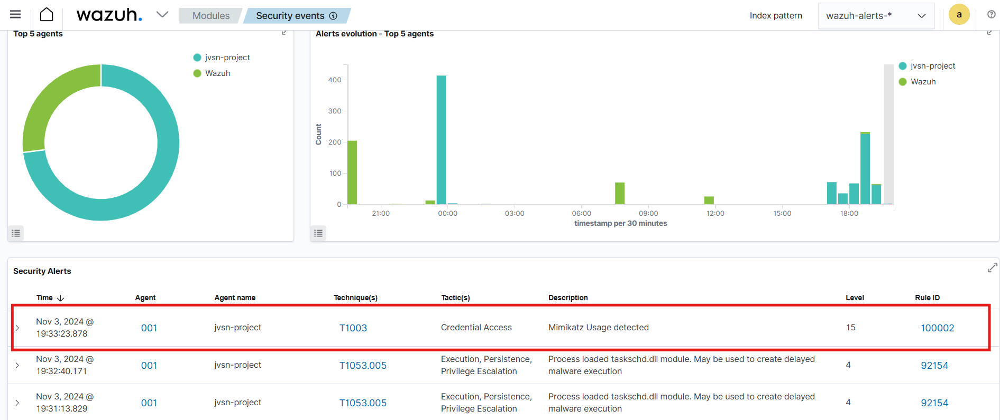

# SOC Automation Project with Wazuh, theHive

This project aims to develop a fully automated Security Operations Center (SOC) solution from scratch, integrating Wazuh for monitoring and TheHive for case management. By leveraging the capabilities of SOAR (Security Orchestration, Automation, and Response), the project explores creative ways to automate threat detection, response, and case management workflows within a SOC environment.

- **Tools**: Wazuh (SIEM/Endpoint Security) and TheHive (Case Management)
- **Scope**: Full implementation from zero to a highly automated SOC solution
- **Goal**: Build a robust, automated SOC environment, pushing the limits of security automation

---
### Contributors
<p align="left">
<a href="https://www.linkedin.com/in/jeyavasan-t/" target="blank"></a>
<a href="https://www.linkedin.com/in/hemanthrajub" target="blank"></a> &nbsp; &nbsp; &nbsp; &nbsp;

---
---

## SOC Automation Project Setup

### Overview
This document outlines the initial setup for the SOC Automation Project, where we establish a foundational SOC environment using tools like Sysmon, Wazuh, and TheHive. This setup phase prepares essential systems and services for monitoring, case management, and incident response capabilities in later stages.

### Project Goal
Set up core components to build a fully automated SOC environment with Wazuh and TheHive for monitoring and incident management.

### Setup Structure

#### Step 1: Installing and Configuring Windows 10 with Sysmon
- **Objective**: Install Windows 10 and set up Sysmon to monitor system activities for enhanced threat detection.
- **Actions**:
  - Install Windows 10 on a virtual machine.
  - Set up Sysmon to log detailed system events for activity tracking.

#### Step 2: Setting Up Wazuh as the SIEM Platform
- **Objective**: Install Wazuh, an open-source SIEM tool, to provide security analytics and enhance incident response.
- **Actions**:
  - Download and install Wazuh on a virtual machine.
  - Configure Wazuh for initial threat detection and monitoring.
  


#### Step 3: Configuring a Secure Firewall for Virtual Machines
- **Objective**: Secure virtual machines from unauthorized access by setting up a robust firewall.
- **Actions**:
  - Set firewall rules to control and restrict access to the virtual machines.


#### Step 4: Installing TheHive for Incident Response Management
- **Objective**: Set up TheHive for efficient case management, allowing for systematic incident tracking and response.
- **Actions**:
  - Install TheHive on a virtual machine.
  - Configure TheHive to handle incident reports and case assignments.

### Key Insights

- 🔍 **Sysmon on Windows 10**: Provides real-time monitoring of system activities, enabling security event analysis.
- 🌐 **Wazuh as an Open-Source SIEM**: Offers essential tools for incident response and security analytics.
- 🔐 **Firewall Configuration**: Adds a layer of security to protect against unauthorized access, emphasizing the need for secure configurations.
- 📊 **Incident Response with TheHive**: Facilitates organized case management, crucial for effective SOC operations.
- 📋 **Software Integrity Verification**: Checking SHA256 checksums ensures the integrity of downloaded software, reducing the risk of tampered files.

---

## Installation of Wazuh


### Step 1: Install Wazuh 4.7
Run the following command to download and execute the Wazuh installation script:
```bash
curl -sO https://packages.wazuh.com/4.7/wazuh-install.sh && sudo bash ./wazuh-install.sh -a
```
### Step 2: Extract Wazuh Credentials
After installation, extract the Wazuh credentials using the following command:

```bash
sudo tar -xvf wazuh-install-files.tar
```

---


# Installation of TheHive


## Overview
TheHive is an open-source incident response platform that enables security teams to efficiently manage and respond to security incidents. This guide provides the steps necessary to install TheHive on your system.

## Prerequisites
Ensure that your system meets the following requirements:
- A compatible Linux distribution.
- Sufficient privileges to execute commands as a superuser (sudo).
- A working internet connection to download the necessary packages.

### Step 1: Add TheHive Repository Key
First, download and add the GPG key for TheHive to ensure the authenticity of the packages:

```bash
wget -O- https://archives.strangebee.com/keys/strangebee.gpg | sudo gpg --dearmor -o /usr/share/keyrings/strangebee-archive-keyring.gpg
```
### Step 2: Add TheHive Repository
Next, add TheHive's repository to your system's sources list:

```bash
echo 'deb [signed-by=/usr/share/keyrings/strangebee-archive-keyring.gpg] https://deb.strangebee.com thehive-5.2 main' | sudo tee -a /etc/apt/sources.list.d/strangebee.list
```
### Step 3: Update Package List
Update your package list to include the newly added TheHive repository:

```bash
sudo apt-get update
```
---
## Wazuh Agent Installation on Windows via PowerShell Command

#### 1. Generate the PowerShell Command from Wazuh Dashboard

1. **Log in to the Wazuh Dashboard**: Open your web browser and log into your Wazuh dashboard.
2. **Navigate to the Agents Section**:
   - In the dashboard, go to **"Agents"** in the left-hand menu.
3. **Add New Agent**:
   - Click on **"Add agent"** to generate an installation command for your Windows machine.
4. **Enter the Wazuh Server's Public Address**:
   - When prompted, provide the public IP address or domain name of your Wazuh server. This allows the agent to communicate with the correct manager.
5. **Copy the PowerShell Command**:
   - After entering the server address, a PowerShell command will be generated for the Windows agent. Copy this command for use in the next step.

#### 2. Run the PowerShell Command on the Windows Machine

1. **Open PowerShell as Administrator**:
   - On the Windows machine, open **PowerShell** with administrator privileges.
2. **Paste and Run the Command**:
   - Paste the copied PowerShell command into the PowerShell window and press **Enter**.
   - This command will download, install, and configure the Wazuh agent to communicate with the Wazuh manager.

#### 3. Verify the Agent Status in Wazuh Dashboard

1. Return to the Wazuh dashboard and navigate to **"Agents"**.
2. Confirm that the Windows agent appears in the list and shows as **active**.


Your Windows agent is now installed and reporting to the Wazuh manager! This method allows you to set up the agent in one step without manually downloading or configuring the installer.

---

## Wazuh configuration and mimikatz alert checking 
### 1. Setup Overview
- The purpose of this phase is to configure telemetry generation from a Windows 10 machine and ensure the telemetry is ingested into Wazuh. By the end of this process, the system will detect Mimikatz activity and trigger a custom alert in Wazuh.

### 2. Configuration of Wazuh
- Navigate to Wazuh’s installation directory, typically located at:

- Open the `ossec.conf` configuration file in Notepad with administrative privileges.

### 3. Modify Log Analysis Settings
- In the configuration file, locate the **Log Analysis** section to identify any event IDs excluded from logging.
- Copy an existing file tag and modify it to monitor for **Mimikatz** activity.
- Ensure **Sysmon** is installed and configured for event logging, as it will provide detailed telemetry for this setup.

### 4. Backup Configuration
- Create a backup of the `ossec.conf` file before making changes to the log settings.

### 5. Configure Sysmon Logs
- Open Windows Event Viewer to identify the **Sysmon channel name**.
- Update `ossec.conf` to include Sysmon logs for ingestion in Wazuh.
- Remove any unnecessary local file applications if focusing solely on Sysmon logs.

### 6. Restart Wazuh Service
- Save the configuration changes and restart the Wazuh service to apply the updated settings.

### 7. Download and Prepare Mimikatz
- Exclude the downloads folder from Windows Defender to allow Mimikatz to be downloaded without interference.
- Download **Mimikatz** and extract it to a designated folder for testing.

### 8. Execute Mimikatz
- Open an **administrative PowerShell** session and navigate to the Mimikatz directory.
- Run `mimikatz.exe` to generate telemetry.


### 9. Monitor Wazuh Dashboard
- Check the Wazuh dashboard for any Sysmon events related to Mimikatz.
- If no events are visible, confirm Sysmon is generating the expected logs by reviewing the configuration.

---

## Custom Alert Creation

### 10. Configure Custom Alert
- Modify `ossec.conf` file in the wazuh server to enable logging for all desired event flags.
- Save the changes and restart the Wazuh service.

### 11. Create a New Index for Archived Logs
- Set up a new index in Wazuh to archive logs, making it easier to search for specific events.


### 12. Test Alert Triggering
- Rename the Mimikatz executable and run it to test alert functionality based on the original file name.
- Verify the Wazuh dashboard for triggered alerts.



Mimikatz events triggered in dashboard

### 13. Final Adjustments
- Make any final adjustments to the alert configurations to ensure they are accurately set to trigger on specific conditions.
---

